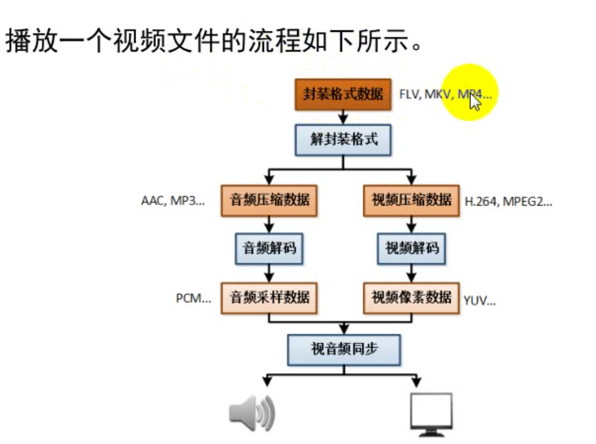
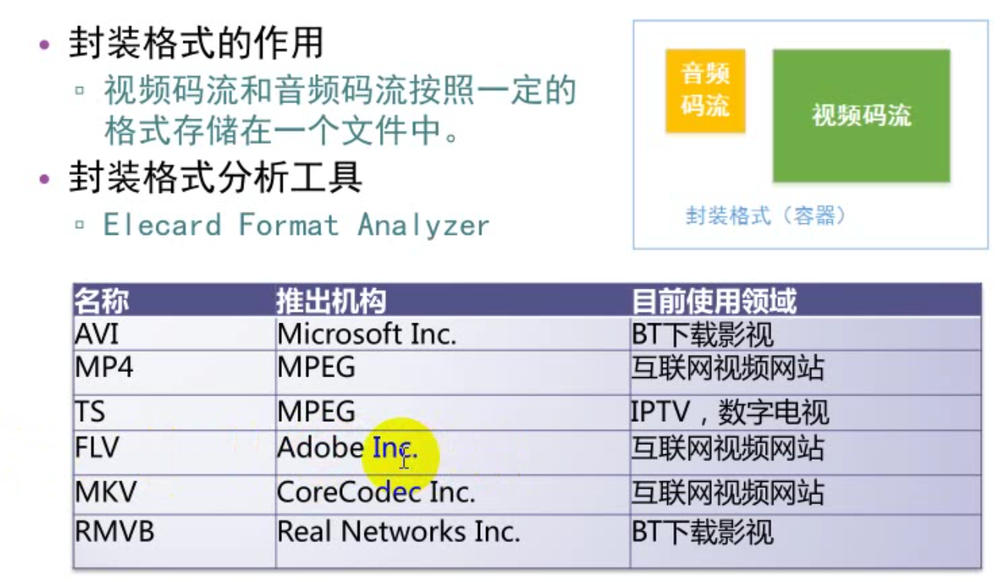
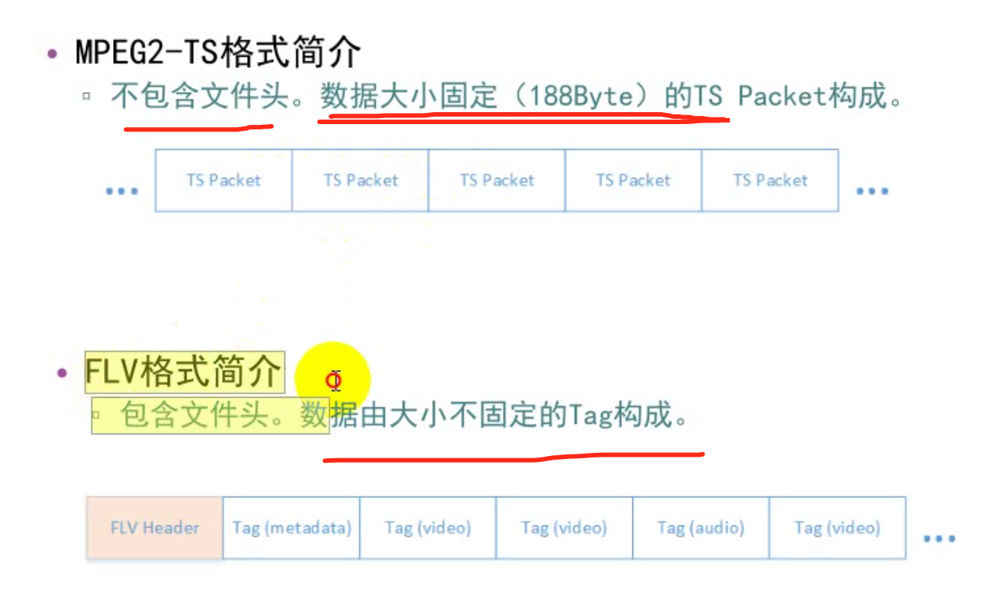

* 封装数据格式flv,mkv,mp4....
* 解封装格式（压缩或编码后的数据：录像、录音实质是一个压缩采集到的图像或音频数据的过程，这个过程又称为编码过程）
	*   视频压缩数据
	*   视频解码 -> 得到的是像素数据（YUV）
	*   音频解码 -> 得到的是音频采样数据（PCM）	
	
* 	播放视频或音频文件，实质上是一个解压缩的过程，这个过程又称为解码
*  视频解码得到-》视频象素数据
*  YUV: Y代表亮度 UV代表色度，人眼对亮度察觉，而对色度不敏感；Y是U和V的4倍. 彩色电视机就是用的YUV，因为它可放黑白，只播放Y的话，播放出来就是黑白；可以使用yuv player单独播放Y、U、V
* 音频 一般采样率:44100

---
* 常用播放器：
	*  跨平台系列：VLC  、 MPlayer 、ffplay
	*  Windows系列（DirectionShow框架）:完美解码、终极解码、暴风影音
*  信息查看工具
	* 综合信息查看：MediaInfo
	* 二进制信息查看：UltraEdit
* 	单项详细分析
	*  封装格式：Elecard Fomat Analyzer
	*  视频编码数据：Elecard Stream Eye
	*  视频像素数据： YUV Player (可以使用yuv player单独播放Y、U、V)
	*  音频采样数据:adobe audition  (查看PCM的软件)  
* 封装格式：
	* 使用：视频码流和音频在码流按照一定的格式存储在一个文件中。

 flv一般不能快进（要快进需要做额外的处理），mpeg2-ts则可以快进；

* 常见编码算法：

,每个NALU的大小不固定，因为它会采用不同的压缩算法，H264里面又包含了很多小的压缩算法，不同的情况，得到帧画面大小不一样；

* 
* 
* 
* 

* [ffmpeg常用命令](https://wenku.baidu.com/view/97f4d3d7e45c3b3566ec8b3d.html?rec_flag=default)