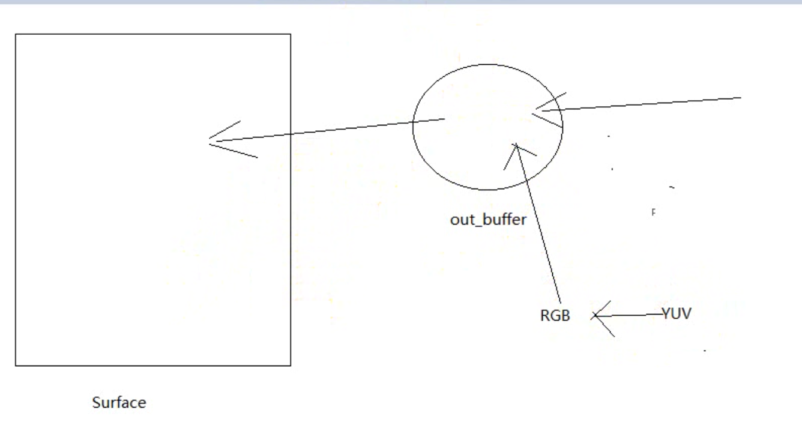

#### 如何在NDK层或JNI里面绘制图像（Natvie原生绘制）？
* 得到一个window：ANativeWindow* nativeWindow = ANativeWindow_fromSurface(env,surface);
* 得到一个缓冲区：ANativeWindow_setBuffersGeometry(nativeWindow, pCodeCtx->width, pCodeCtx->height,WINDOW_FORMAT_RGBA_8888);
* lockwindow：ANativeWindow_lock(nativeWindow,&outBuffer,NULL);
* unlockwindow：ANativeWindow_unlockAndPost(nativeWindow);

* xml代码

````
<FrameLayout xmlns:android="http://schemas.android.com/apk/res/android"
    xmlns:tools="http://schemas.android.com/tools"
    android:layout_width="match_parent"
    android:layout_height="match_parent">

    <com.dongnaoedu.dnffmpegplayer.view.VideoView 
        android:id="@+id/video_view"
        android:layout_width="fill_parent"
        android:layout_height="fill_parent"/>

    <LinearLayout 
        android:layout_width="wrap_content"
        android:layout_height="wrap_content"
        android:orientation="horizontal">
        <Spinner 
		    android:id="@+id/sp_video"
		    android:layout_width="wrap_content"
		    android:layout_height="wrap_content"
		    />
        <Button
	       android:layout_width="wrap_content"
	       android:layout_height="wrap_content"
	       android:text="开始"
	       android:onClick="mPlay" />
        
    </LinearLayout>
    
</FrameLayout>

````

* surfaceView

````
/**
 * 视频绘制的"画布"
 */
public class VideoView extends SurfaceView {

	public VideoView(Context context) {
		super(context);
		init();
	}

	public VideoView(Context context, AttributeSet attrs) {
		super(context, attrs);
		init();
	}

	public VideoView(Context context, AttributeSet attrs, int defStyle) {
		super(context, attrs, defStyle);
		init();
	}
	
	private void init(){
		//初始化，SufaceView绘制的像素格式
		SurfaceHolder holder = getHolder();
		holder.setFormat(PixelFormat.RGBA_8888);
	}

}

````

* MainActivity

````
public class MainActivity extends Activity {

	private JasonPlayer player;//native接口
	private VideoView videoView;
	private Spinner sp_video;

	@Override
	protected void onCreate(Bundle savedInstanceState) {
		super.onCreate(savedInstanceState);
		setContentView(R.layout.activity_main);
		videoView = (VideoView) findViewById(R.id.video_view);
		sp_video = (Spinner) findViewById(R.id.sp_video);
		player = new JasonPlayer();
		//多种格式的视频列表
		String[] videoArray = getResources().getStringArray(R.array.video_list);//视频名称（sdcard上）
		ArrayAdapter<String> adapter = new ArrayAdapter<String>(this, 
				android.R.layout.simple_list_item_1, 
				android.R.id.text1, videoArray);
		sp_video.setAdapter(adapter);
	}

	public void mPlay(View btn){
		String video = sp_video.getSelectedItem().toString();
		//sdcard视频文件路径
		String input = new File(Environment.getExternalStorageDirectory(),video).getAbsolutePath();
		//Surface传入到Native函数中，用于绘制
		Surface surface = videoView.getHolder().getSurface();
		player.render(input, surface);//调用Native方法绘制
	}
}

````

* Native方法声明

````

public class JasonPlayer {

	public native void render(String input,Surface surface);
	
	static{
		System.loadLibrary("avutil-54");
		System.loadLibrary("swresample-1");
		System.loadLibrary("avcodec-56");
		System.loadLibrary("avformat-56");
		System.loadLibrary("swscale-3");
		System.loadLibrary("postproc-53");
		System.loadLibrary("avfilter-5");
		System.loadLibrary("avdevice-56");
		System.loadLibrary("myffmpeg");
	}
}
````

* JNI部份

````

#include "com_dongnaoedu_dnffmpegplayer_JasonPlayer.h"
#include <stdlib.h>
#include <stdio.h>
#include <unistd.h>
#include <android/log.h>
#include <android/native_window_jni.h>
#include <android/native_window.h>
#define LOGI(FORMAT,...) __android_log_print(ANDROID_LOG_INFO,"jason",FORMAT,##__VA_ARGS__);
#define LOGE(FORMAT,...) __android_log_print(ANDROID_LOG_ERROR,"jason",FORMAT,##__VA_ARGS__);
#include "libyuv.h"

//封装格式
#include "libavformat/avformat.h"
//解码
#include "libavcodec/avcodec.h"
//缩放
#include "libswscale/swscale.h"


JNIEXPORT void JNICALL Java_com_dongnaoedu_dnffmpegplayer_JasonPlayer_render
  (JNIEnv *env, jobject jobj, jstring input_jstr, jobject surface){
	const char* input_cstr = (*env)->GetStringUTFChars(env,input_jstr,NULL);
	//1.注册组件
	av_register_all();

	//封装格式上下文
	AVFormatContext *pFormatCtx = avformat_alloc_context();

	//2.打开输入视频文件
	if(avformat_open_input(&pFormatCtx,input_cstr,NULL,NULL) != 0){
		LOGE("%s","打开输入视频文件失败");
		return;
	}
	//3.获取视频信息
	if(avformat_find_stream_info(pFormatCtx,NULL) < 0){
		LOGE("%s","获取视频信息失败");
		return;
	}

	//视频解码，需要找到视频对应的AVStream所在pFormatCtx->streams的索引位置
	int video_stream_idx = -1;
	int i = 0;
	for(; i < pFormatCtx->nb_streams;i++){
		//根据类型判断，是否是视频流
		if(pFormatCtx->streams[i]->codec->codec_type == AVMEDIA_TYPE_VIDEO){
			video_stream_idx = i;
			break;
		}
	}

	//4.获取视频解码器
	AVCodecContext *pCodeCtx = pFormatCtx->streams[video_stream_idx]->codec;
	AVCodec *pCodec = avcodec_find_decoder(pCodeCtx->codec_id);
	if(pCodec == NULL){
		LOGE("%s","无法解码");
		return;
	}

	//5.打开解码器
	if(avcodec_open2(pCodeCtx,pCodec,NULL) < 0){
		LOGE("%s","解码器无法打开");
		return;
	}

	//编码数据
	AVPacket *packet = (AVPacket *)av_malloc(sizeof(AVPacket));

	//像素数据（解码数据）
	AVFrame *yuv_frame = av_frame_alloc();//解码后的frame
	AVFrame *rgb_frame = av_frame_alloc();

	//native绘制
	//窗体
	ANativeWindow* nativeWindow = ANativeWindow_fromSurface(env,surface);
	//绘制时的缓冲区
	ANativeWindow_Buffer outBuffer;

	int len ,got_frame, framecount = 0;
	//6.一阵一阵读取压缩的视频数据AVPacket
	while(av_read_frame(pFormatCtx,packet) >= 0){
		//解码AVPacket->AVFrame
		len = avcodec_decode_video2(pCodeCtx, yuv_frame, &got_frame, packet);

		//Zero if no frame could be decompressed
		//非零，正在解码
		if(got_frame){
			LOGI("解码%d帧",framecount++);
			//lock
			//设置缓冲区的属性（宽、高、像素格式）
			ANativeWindow_setBuffersGeometry(nativeWindow, pCodeCtx->width, pCodeCtx->height,WINDOW_FORMAT_RGBA_8888);
			ANativeWindow_lock(nativeWindow,&outBuffer,NULL);//锁定窗口、缓冲区

			//设置rgb_frame的属性（像素格式、宽高）和缓冲区
			//rgb_frame缓冲区与outBuffer.bits是同一块内存
			//avpicture_fill的功能：设置rgb_frame的属性，将outBuffer.bits指向的数据填充到rgb_frame
			//rgb_frame的缓冲区就是outBuffer缓存区
			avpicture_fill((AVPicture *)rgb_frame, outBuffer.bits, PIX_FMT_RGBA, pCodeCtx->width, pCodeCtx->height);

			//YUV->RGBA_8888   yuv转rgb,然后把rgb放到缓冲区
			I420ToARGB(yuv_frame->data[0],yuv_frame->linesize[0],//Y,yuv_frame->linesize[0]：一行Y数据的大小
					yuv_frame->data[2],yuv_frame->linesize[2],//U
					yuv_frame->data[1],yuv_frame->linesize[1],//V
					rgb_frame->data[0], rgb_frame->linesize[0],//转换结果输出到rgb_frame,即数据到了outBuffer缓存区，最终到了surcefaceView
					//当解锁窗口后，就会把outBuffer缓存区绘制到surcefaceView
					pCodeCtx->width,pCodeCtx->height);//转换后的宽高不变
			//上面使用了libyuv库，下载地址：https://chromium.googlesource.com/external/libyuv

               /*
                int I420ToARGB(const uint8* src_y, int src_stride_y,
                            const uint8* src_u, int src_stride_u,
                            const uint8* src_v, int src_stride_v,
                            uint8* dst_argb, int dst_stride_argb,
                            int width, int height);
           */
			//unlock
			ANativeWindow_unlockAndPost(nativeWindow);

			usleep(1000 * 16);

		}

		av_free_packet(packet);
	}

	ANativeWindow_release(nativeWindow);
	av_frame_free(&yuv_frame);
	avcodec_close(pCodeCtx);
	avformat_free_context(pFormatCtx);

	(*env)->ReleaseStringUTFChars(env,input_jstr,input_cstr);
}


````

